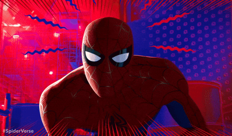
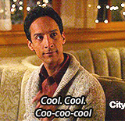

## _OK, on se le fait une dernière fois._
_Mon nom est Peter Parker. J'ai été mordu par une araignée radioactive, et pendant les 10 dernieres année, j'ai été le seule et unique Spider - Man ..._

  <h1>
  
  </h1>

### __Ok nan, j'crois que je me suis trompé d'histoire__

OK, on se le fait pour la vrai dernière fois. Mon nom est Favien (le GOAT tous simplement), je suis étudiant en deuxieme année de BUT informatique a l'IUT Robert-Schuman.

J'aime dev (sinon je serai pas la), les jeux video (original), le jeux de role (original x2), les comics(mais je suis pauvre), les series (surtout d'animations (regarder Steven Universe)), faire des refs que personne n'a (mais bon tel est la voix) **et je suis vraiment tres nul pour me presenter.**

# Donc voila quelque truc que je sais utilisé et quelque projet que j'ai fait

<table>
<tr>
<td valign="top" width="50%">
  
<b>Languages</b>

  

    
  

  
<b>Tools</b>

  

    
  

  
<b>Frameworks</b>

  

    
  

  

    
  

</td>

<td valign="middle" width="50%">
  
<b>Featured Projects</b> 

  

    
     
    
     
    
  

</td>
</tr>
</table>
  

    <h1>
    
    </h1>
  

